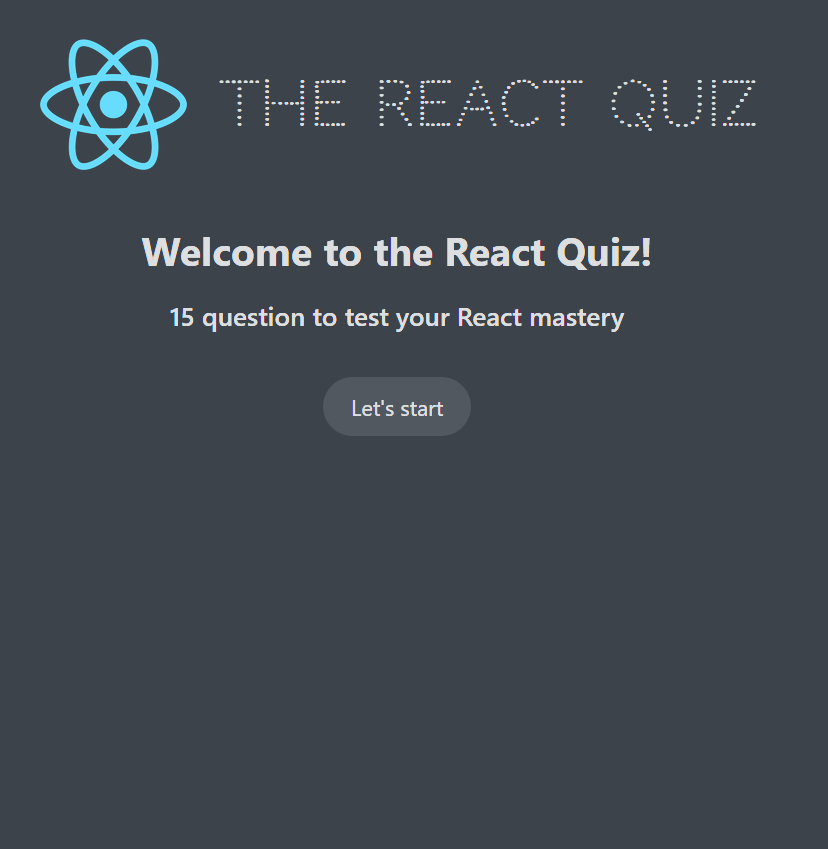
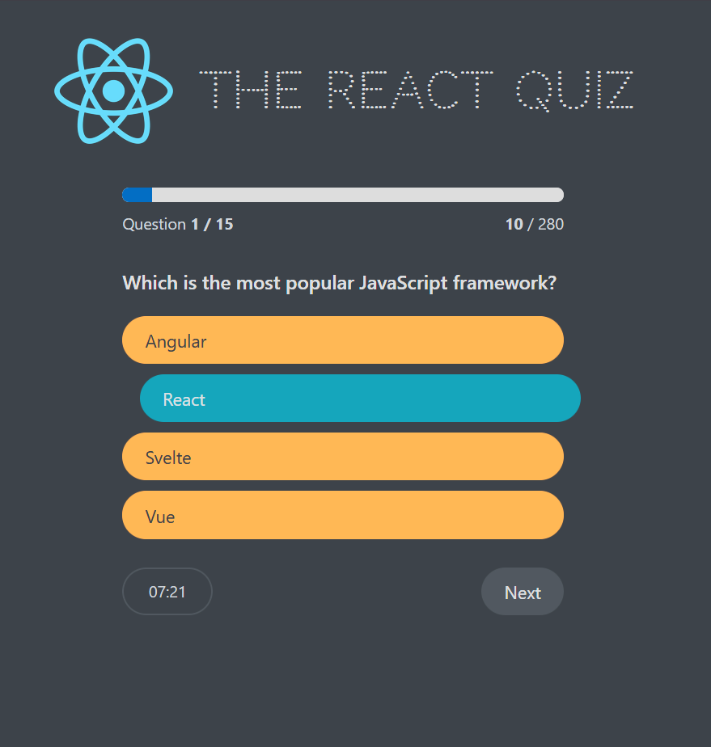
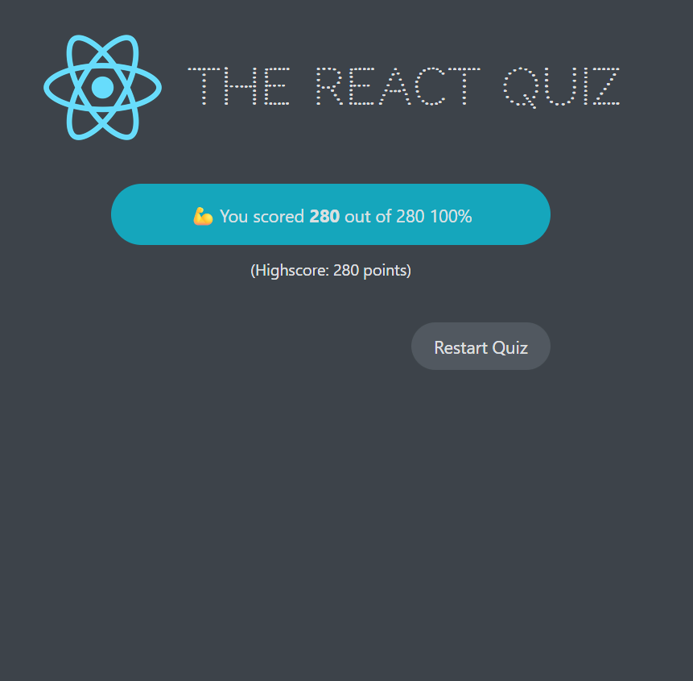

# ⚛️ The React Quiz

A quiz app built with React to test your knowledge of basic React concepts. This project was built primarily as a practice exercise for working with the **`useReducer`** hook for complex state management, and for **fetching data from a fake REST API** using `json-server`.

## 📸 Preview

### Start screen

A welcome screen showing the number of questions and a button to begin.

### Question screen

Displays the current question, a progress bar, a running score, answer options, and a countdown timer.

### Finish screen

Shows the final score, percentage, and the highscore, with an option to restart the quiz.

## ✨ Features

- **15 multiple-choice questions** on core React concepts
- **Progress bar** that tracks how far you are through the quiz
- **Live score tracking** displayed as `points earned / total possible points`
- **Countdown timer** per quiz attempt - running out of time ends the quiz automatically
- **Answer feedback** - correct and incorrect answers are highlighted immediately after selection
- **Highscore tracking** - the best score is remembered across attempts
- **Restart functionality** to retake the quiz at any time

## 🛠️ Built With

- **`useReducer`** : to manage all quiz state (status, questions, current question index, answer, score, highscore, timer) through a single reducer function instead of multiple `useState` calls
- **`useEffect`** : for fetching data and running the timer
- **`json-server`** : to simulate a real backend/API for serving quiz questions
- **regular CSS** : for styling and layout
